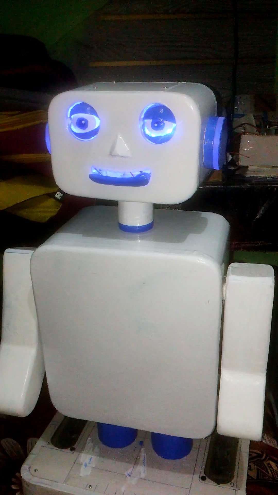
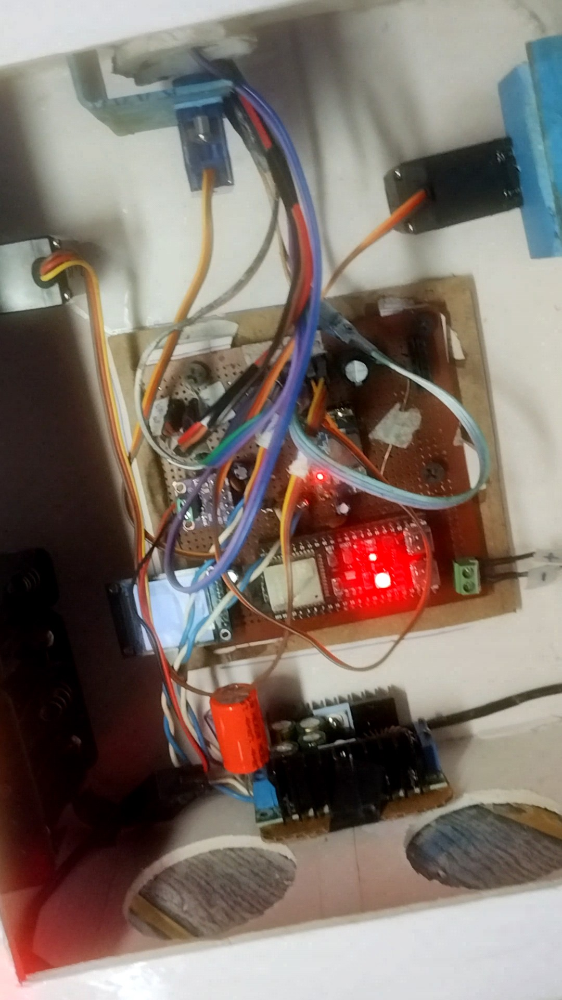
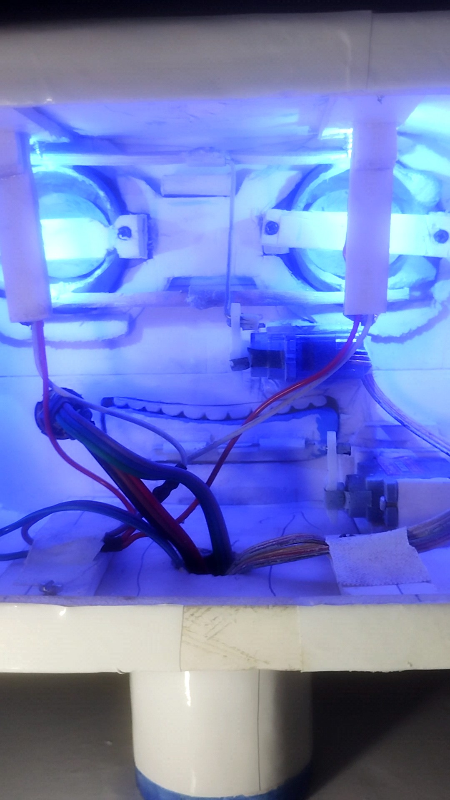
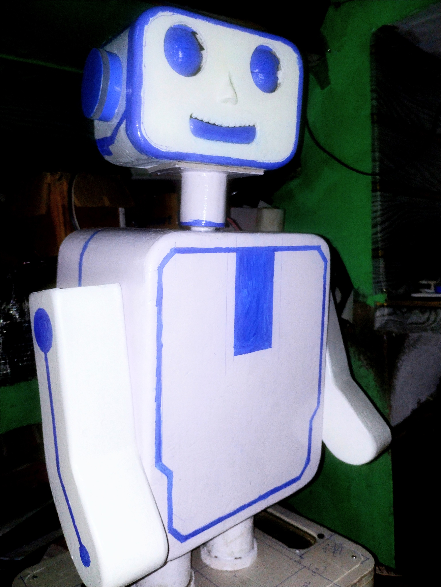

# EVA 2.0 – AI Voice Assistant Robot

> An ESP32-S3 based AI voice assistant robot developed through embedded systems engineering, custom hardware integration, firmware customization, and rapid prototyping.

## Overview

EVA 2.0 is a custom AI voice assistant robot developed as a hands-on embedded systems project.

The system combines an **ESP32-S3 microcontroller**, digital microphone, audio amplifier, speaker, SPI display, servo-driven mechanisms, and AI-powered voice interaction into a single robotic platform.

The project focuses on integrating **software, embedded firmware, electronics, audio systems, AI interaction, and mechanical control** into a working physical prototype.

The project is based on and modified from the open-source **XiaoZhi ESP32** framework. This repository documents my hardware integration, firmware customization, peripheral configuration, debugging, and implementation work.

---

## My Contributions

- Integrated the ESP32-S3 controller with the custom robot hardware
- Integrated the SPI display for visual feedback
- Integrated the INMP441 digital MEMS microphone
- Integrated the MAX98357A I2S audio amplifier
- Configured speaker audio output
- Implemented custom servo control
- Configured GPIO and PWM based peripheral control
- Added custom MCP-based device-control functionality
- Modified firmware according to custom hardware requirements
- Configured audio input and output interfaces
- Designed and tested the robot power architecture
- Integrated multiple hardware modules
- Debugged firmware, wiring, power, and hardware-integration issues
- Tested the complete system with real-world voice interaction

---

## Hardware

| Component | Purpose |
|---|---|
| ESP32-S3 | Main controller |
| SPI Display | Visual interface and feedback |
| INMP441 | Digital MEMS microphone |
| MAX98357A | I2S audio amplifier |
| Speaker | Voice/audio output |
| Servo Motors | Robot movement and mechanisms |
| Li-ion Battery Pack | Portable power source |
| DC-DC Buck Converter | Regulated power supply |

---

## System Architecture

```
                    +----------------+
                    |    AI / LLM    |
                    | Voice Interaction|
                    +--------+-------+
                             |
                           Wi-Fi
                             |
                             v
                    +----------------+
                    |    ESP32-S3    |
                    | Main Controller |
                    +--------+-------+
                             |
              +--------------+--------------+
              |                             |
              v                             v
       +-------------+               +-------------+
       |   INMP441   |               |   Display   |
       | Audio Input |               |  Visual UI  |
       +------+------+               +-------------+
              |
              v
       +-------------+
       | MAX98357A   |
       | Audio Output|
       +------+------+
              |
              v
          Speaker


                    ESP32-S3
                        |
                    PWM / GPIO
                        |
                        v
                  +-----------+
                  |  Servos   |
                  +-----------+
```

## Embedded Technologies

- ESP32-S3
- ESP-IDF
- C/C++
- I2S Audio
- SPI
- GPIO
- PWM
- Wi-Fi
- MCP (Model Context Protocol)
- Embedded firmware development

---

## Development Focus

This project focuses on practical implementation of:

- Embedded systems
- AI + hardware integration
- Voice-controlled devices
- Microcontroller peripherals
- Servo control
- Digital audio
- SPI display interfacing
- I2S communication
- GPIO and PWM control
- Power management
- Firmware customization
- Hardware debugging
- Rapid hardware prototyping

---

## Project Photos

### EVA 2.0 — Final Prototype



### Internal Electronics



### Hardware Assembly



### Testing



---

## Demo

A demonstration of EVA 2.0's AI voice interaction, display feedback, audio system, and hardware functionality.

▶️ **Watch the EVA 2.0 demonstration on YouTube:**

[](https://www.youtube.com/watch?v=ABC123)

**YouTube:** [EVA 2.0 – AI Voice Assistant Robot](https://www.youtube.com/watch?v=ABC123)

---

## Base Framework

EVA 2.0 is built using and modified from the open-source **XiaoZhi ESP32** project.

The original framework provides the foundation for AI voice interaction and MCP-based device control.

This repository focuses on my implementation and modifications for the custom EVA 2.0 robot hardware.

---

## Project Status

**Status: Working Prototype**

The robot has been assembled and tested with its major hardware and firmware components integrated.

Current development areas include:

- Mechanical refinement
- Power optimization
- Firmware stability
- Hardware reliability
- Audio optimization
- Further peripheral integration

---

## Engineering Highlights

EVA 2.0 demonstrates practical experience in combining multiple engineering domains into one working system:

**AI → Embedded Firmware → Microcontroller → Digital Audio → Display → Servo Control → Physical Hardware**

The project involved both software and hardware debugging, making it a practical embedded-systems development project rather than a software-only prototype.

---

## Author

### Saif Khan

**B.Tech Computer Science & Engineering**

Embedded Systems | Electronics | IoT | Hardware Prototyping

This repository documents my implementation, modifications, hardware integration, and engineering work on the EVA 2.0 project.

---

## Note

This project is based on and modified from the open-source XiaoZhi ESP32 framework.

Credit remains with the original authors and contributors of the underlying framework.

The purpose of this repository is to document my own hardware integration, firmware customization, experimentation, debugging, and development work.
