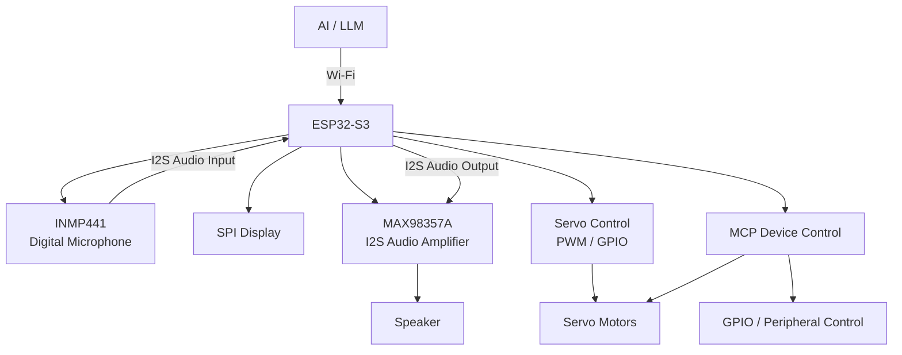

# EVA 2.0 — System Architecture

## High-Level Architecture

EVA 2.0 combines AI voice interaction, embedded firmware, digital audio, display control, and physical servo mechanisms into a single embedded system.



## Hardware Flow

```text
              AI / LLM
                  |
                Wi-Fi
                  |
                  v
            +-----------+
            | ESP32-S3  |
            | Controller|
            +-----------+
             /    |    \
            /     |     \
           v      v      v
       Display  Audio   Servo
         SPI     I2S    PWM/GPIO
                 |        |
                 v        v
            MAX98357A   Motors
                 |
                 v
              Speaker
                 
       INMP441
          |
          | I2S
          v
       ESP32-S3
```

## Main Communication Interfaces

| Subsystem | Interface | Controller |
|---|---|---|
| Display | SPI | ESP32-S3 |
| Microphone | I2S | ESP32-S3 |
| Audio Amplifier | I2S | ESP32-S3 |
| Servos | PWM / GPIO | ESP32-S3 |
| AI Communication | Wi-Fi | ESP32-S3 |
| Device Control | MCP | ESP32-S3 |

## Software Architecture

```text
AI / Voice Interaction
          |
          v
     XiaoZhi Framework
          |
          v
      ESP32-S3
          |
     +----+----+
     |         |
     v         v
Peripherals   MCP
     |         |
     v         v
Display     Hardware
Audio       Control
Servo
GPIO
```

## Engineering Focus

The project combines:

- Embedded systems
- ESP32-S3 firmware
- C/C++
- ESP-IDF
- I2S audio
- SPI display communication
- GPIO and PWM control
- Servo control
- Wi-Fi communication
- MCP-based device control
- Hardware debugging
- Power-system integration
- Rapid hardware prototyping
